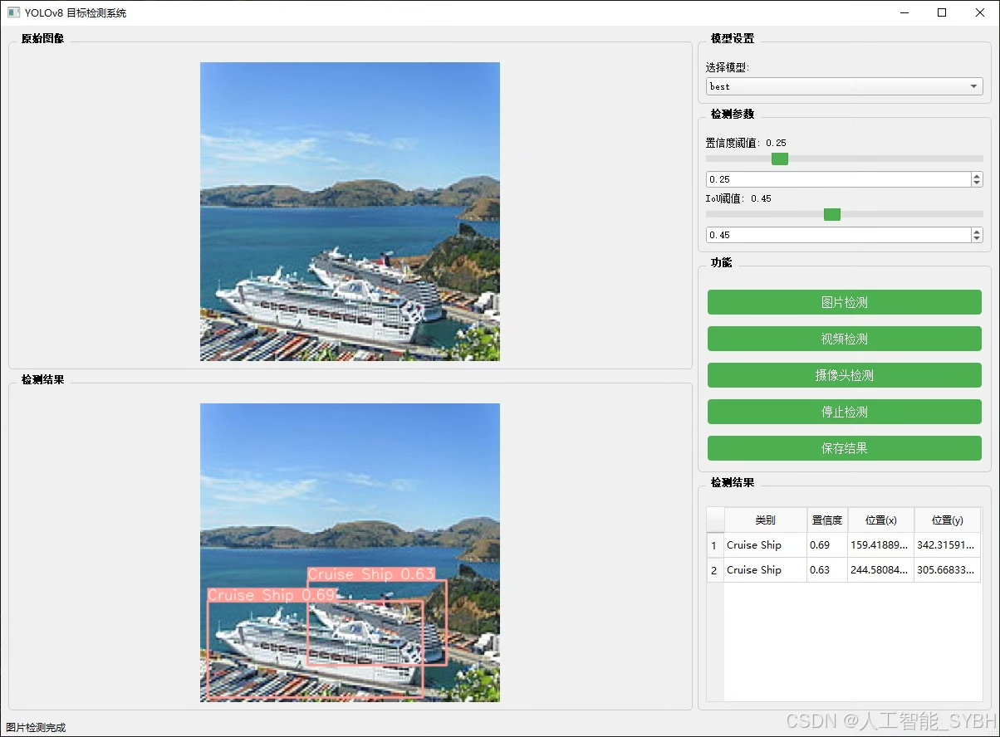
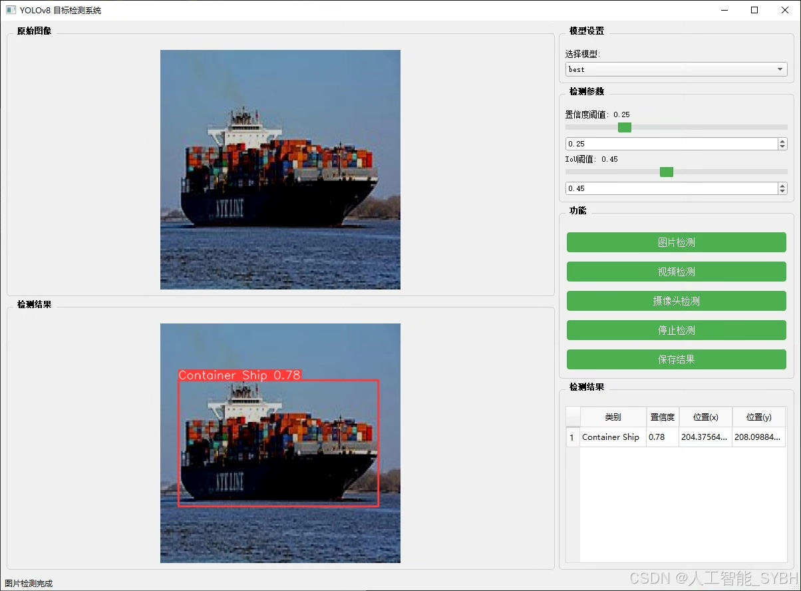
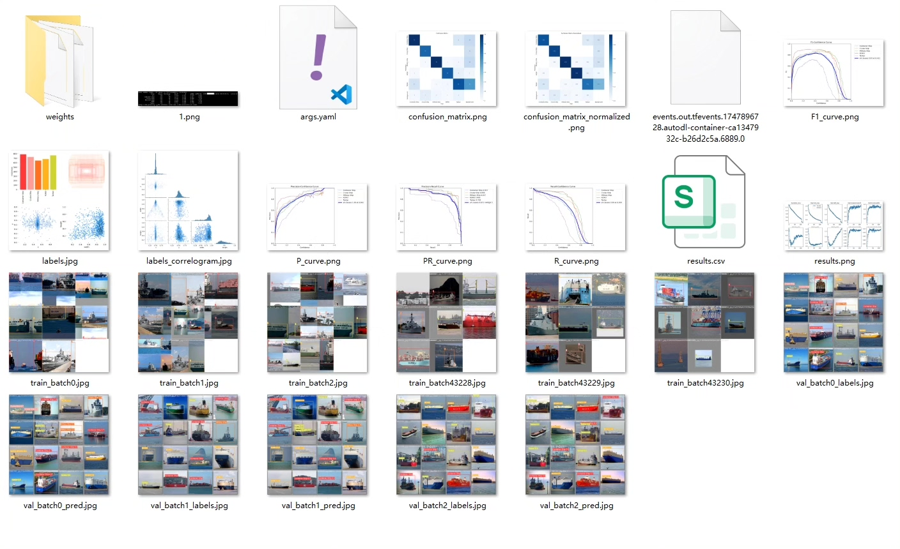
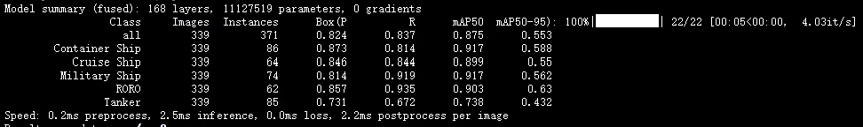
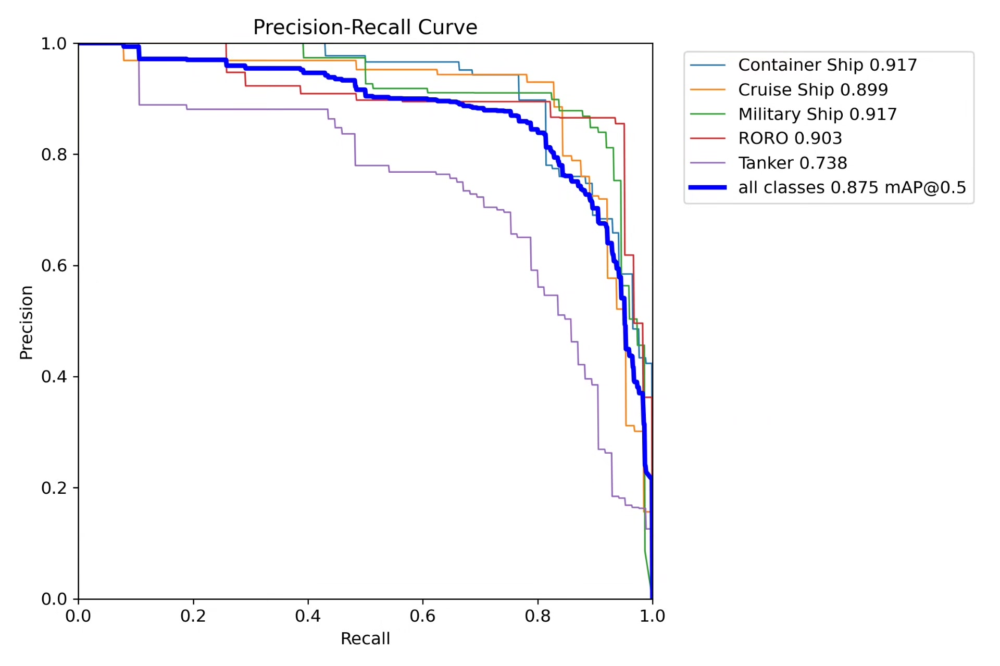
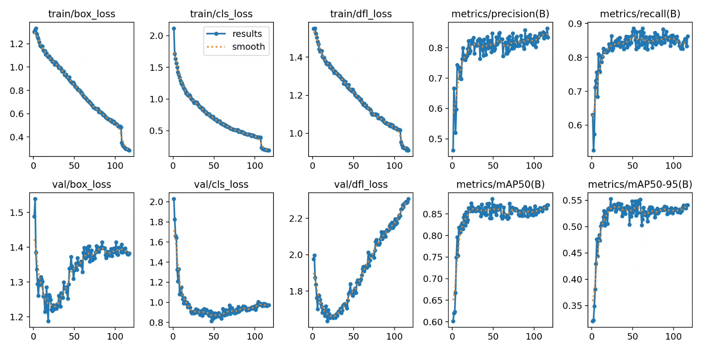
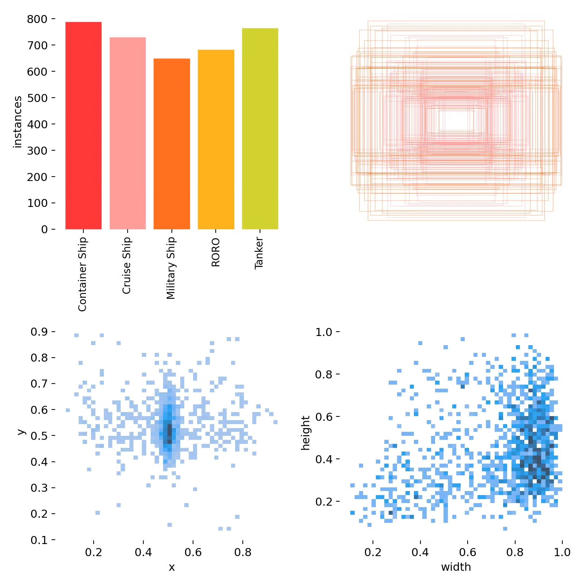
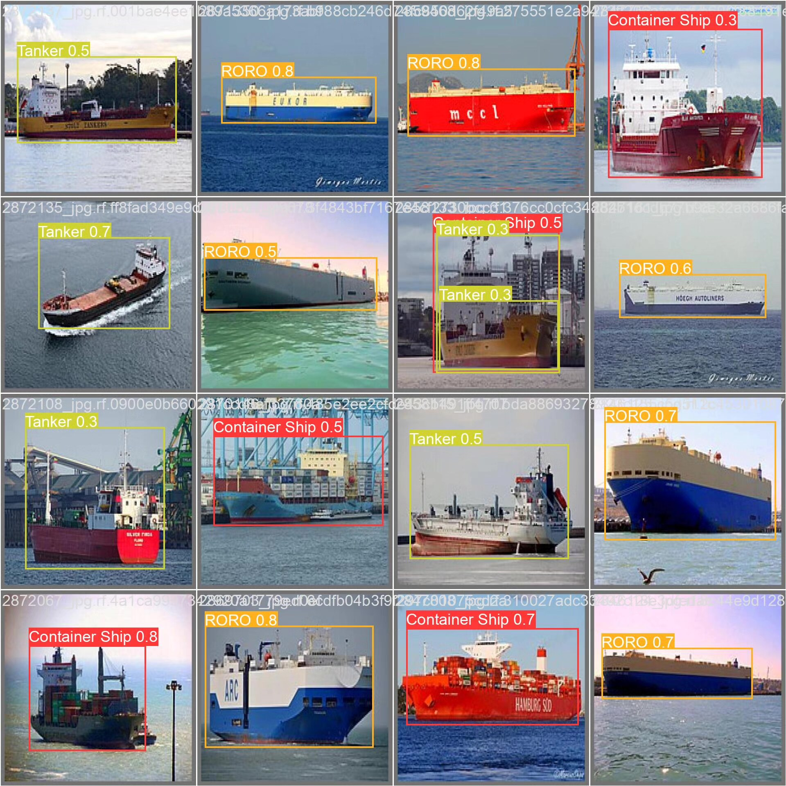

# Based on deep learning YOLOv8, the ship classification and recognition detection system

## Body

Based on the YOLOv8 deep learning framework, this project has developed an advanced ship classification and recognition detection system that can automatically identify and classify five main types of ships: container ships (Container Ship), cruise ships (Cruise Ship), military ships (Military Ship), roll-on/roll-off (RORO) ships, and tankers (Tanker). The system utilizes a dataset containing 3,721 high-quality labeled images (3,232 training images, 339 validation images, and 150 test images), achieving high accuracy in ship detection and classification through fine-tuned models and transfer learning techniques.

The company's products have obtained the official commercial license certification from YOLO.

We offer after-sales service.

After payment, we will provide WeChat ID for any questions you may have.

Environmental configuration: We will provide a tutorial on how to set up the environment, with WeChat providing answers to questions.

Remote installation services: If you need remote configuration, an additional fee of 69 is required.
If the configuration fails, all fees will be refunded (specially for older computers only refunding installation fees).

Retraining the dataset: After setting up the environment, you can train on your own computer.
If you need us to retrain, just pay 69 plus computing power fees (2.5 yuan/hour).

Full after-sales service

## Images

## Payment

Here is a pay link on Stripe ( https://buy.stripe.com/3cs8yP7sY87d0vu9AB ). Please contact me lonlonago@foxmail.com after funding $89, and I will send you a complete data files , thank you!

